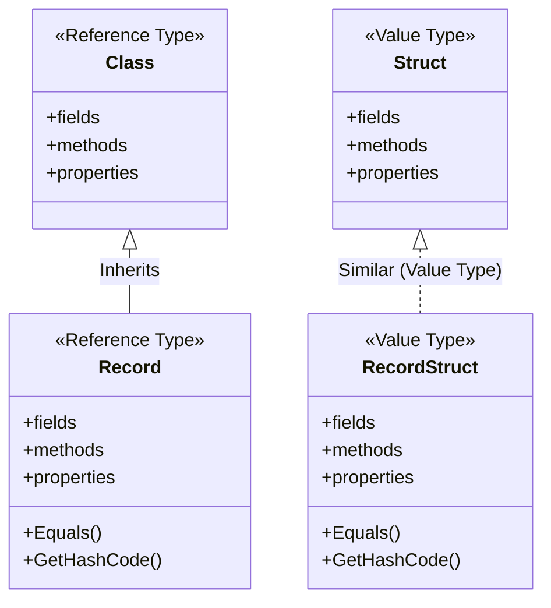
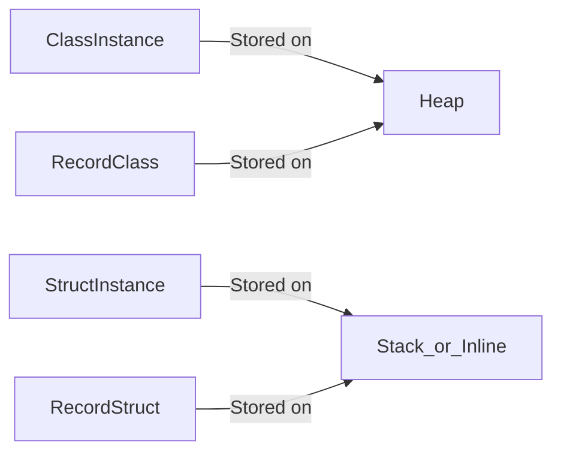
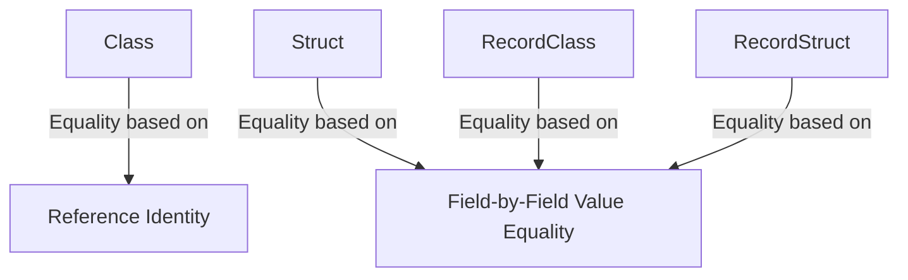
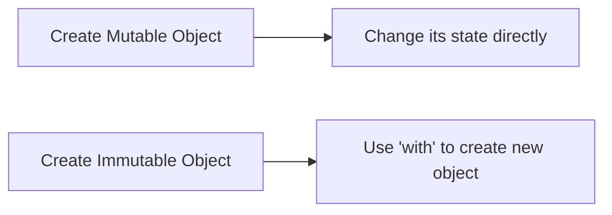

# Advanced C#: Classes, Records, and Structs
---

## Overview

In C#, **Class**, **Struct**, and **Record** are types used to define custom data structures. Each has unique characteristics regarding memory allocation, behavior, and use cases.

---

## 1. Class

- **Reference type**: Stored on the heap, accessed via reference.
- Supports **inheritance**.
- Can have **mutable** or **immutable** fields.
- Used for complex objects with identity and behavior.
- Garbage collected by .NET runtime.
- Default constructor can be parameterless or parameterized.

### Example:

```csharp
public class Person
{
    public string Name { get; set; }
    public int Age { get; set; }
}
```

---

## 2. Struct

- **Value type**: Stored on the stack or inline in containing types.
- No inheritance (cannot derive from another struct or class, but can implement interfaces).
- Typically **immutable** to avoid copying issues, but can be mutable.
- Lightweight and efficient for small data objects.
- Used for small data carriers, like points or complex numbers.

### Example:

```csharp
public struct Point
{
    public int X { get; }
    public int Y { get; }

    public Point(int x, int y) 
    {
        X = x;
        Y = y;
    }
}
```

---

## 3. Record

- Introduced in C# 9.0.
- By default, **reference type** (can be value type with `record struct`).
- Designed for **immutable data** models with value equality semantics.
- Supports **positional parameters** and concise syntax.
- Supports inheritance among records.
- Automatically implements `Equals()`, `GetHashCode()`, and `ToString()` methods.

### Example (record class):

```csharp
public record PersonRecord(string Name, int Age);
```

### Example (record struct):

```csharp
public record struct PointRecord(int X, int Y);
```

---

# Key Differences

| Feature           | Class          | Struct         | Record (class)        | Record (struct)       |
|-------------------|----------------|----------------|-----------------------|-----------------------|
| Type              | Reference      | Value          | Reference             | Value                 |
| Memory            | Heap           | Stack / Inline | Heap                  | Stack / Inline        |
| Inheritance       | Yes            | No             | Yes                   | No                    |
| Default Mutability | Mutable        | Usually immutable (recommended) | Immutable by default   | Immutable by default   |
| Equality          | Reference-based| Value-based (field-wise) | Value-based (field-wise) | Value-based (field-wise) |
| Syntax            | Verbose        | Verbose        | Concise with positional syntax | Concise with positional syntax |

---

### 1. Type Hierarchy and Relationships



---

### 2. Memory Allocation & Usage



---

### 3. Equality Behavior



---

# Summary

- Use **Class** for complex objects with identity and lifecycle, especially when inheritance is needed.
- Use **Struct** for small, immutable data carriers that benefit from stack allocation.
- Use **Record** for immutable data models where value-based equality and concise syntax are desirable.
- **Record structs** are value-type records introduced for immutable value types with record capabilities.

---
---
---
## Immutable vs Mutable in C#

---

### What Does It Mean?

In programming, especially in C#, **mutability** refers to whether or not an object's state (its data) can be changed after it's created.

---

### Mutable

- **Definition**: A mutable object **can be changed** after it's been created.
- **Example**: Regular classes (`class`) with settable properties or public fields.
- **Behavior**: You can update its fields/properties any time.

#### Example:

```csharp
public class Person
{
    public string Name { get; set; }  // Mutable property
    public int Age { get; set; }
}

var person = new Person { Name = "Alice", Age = 30 };
person.Name = "Bob";  // Allowed — mutable
```

- **When to use**:
  - When the object is expected to change during its lifetime.
  - For interactive or dynamic data models (like UI-bound objects).

---

### Immutable

- **Definition**: An immutable object **cannot be changed** once created.
- **Example**: `record` types in C# or `struct` with `readonly` fields.
- **Behavior**: After initialization, the data is fixed.

#### Example:

```csharp
public record PersonRecord(string Name, int Age);

var person = new PersonRecord("Alice", 30);
// person.Name = "Bob"; // Not allowed

var updatedPerson = person with { Name = "Bob" };  // Creates a new object
```

- **When to use**:
  - In multithreaded scenarios for thread safety.
  - When consistency and predictability of data is crucial.
  - In functional programming and data modeling.

---

## Summary Comparison

| Feature          | Mutable                           | Immutable                            |
|------------------|------------------------------------|--------------------------------------|
| Data Changeable? | Yes                                | No                                   |
| Thread Safety    | Requires synchronization           | Naturally thread-safe                |
| How to change?   | Modify existing properties         | Create a new instance                |
| Used In          | Classes with `set` properties      | `record`, `readonly struct`, `init` |
| Example Type     | `class Person`                     | `record PersonRecord`                |

---

## Visual Diagram



---

## Final Thoughts

- **Mutable** is flexible but needs care in shared environments (like multi-threaded code).
- **Immutable** is safe and predictable, but changes require creating new instances.
- C# encourages immutability in many modern features like records, `init` accessors, and functional patterns.
